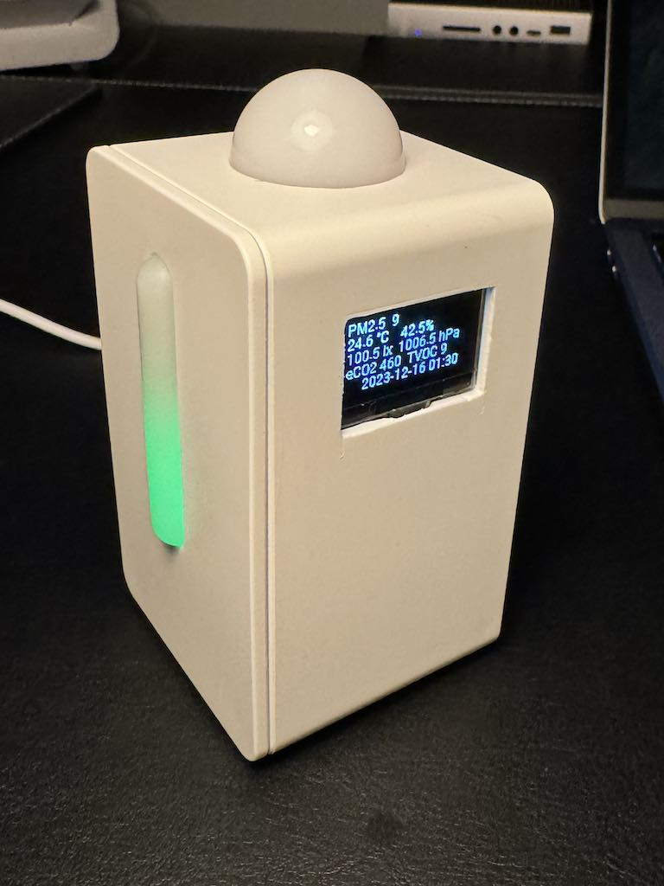
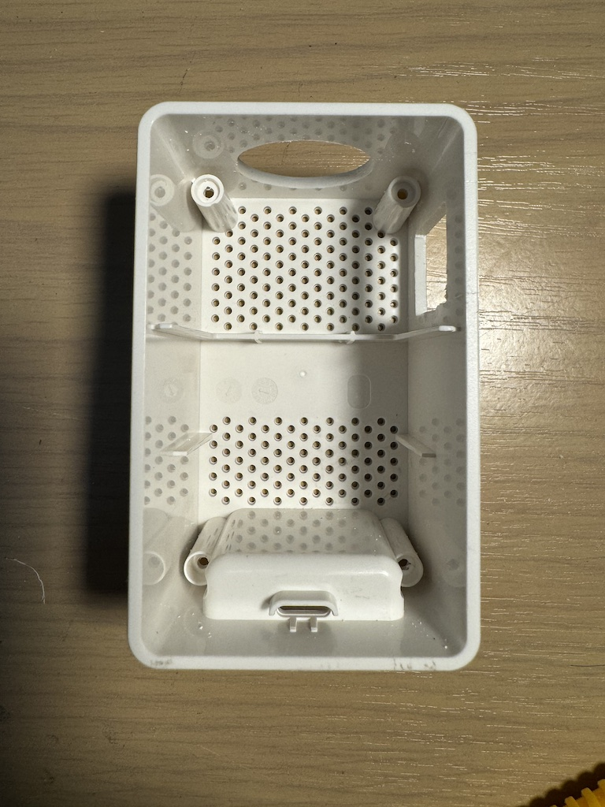
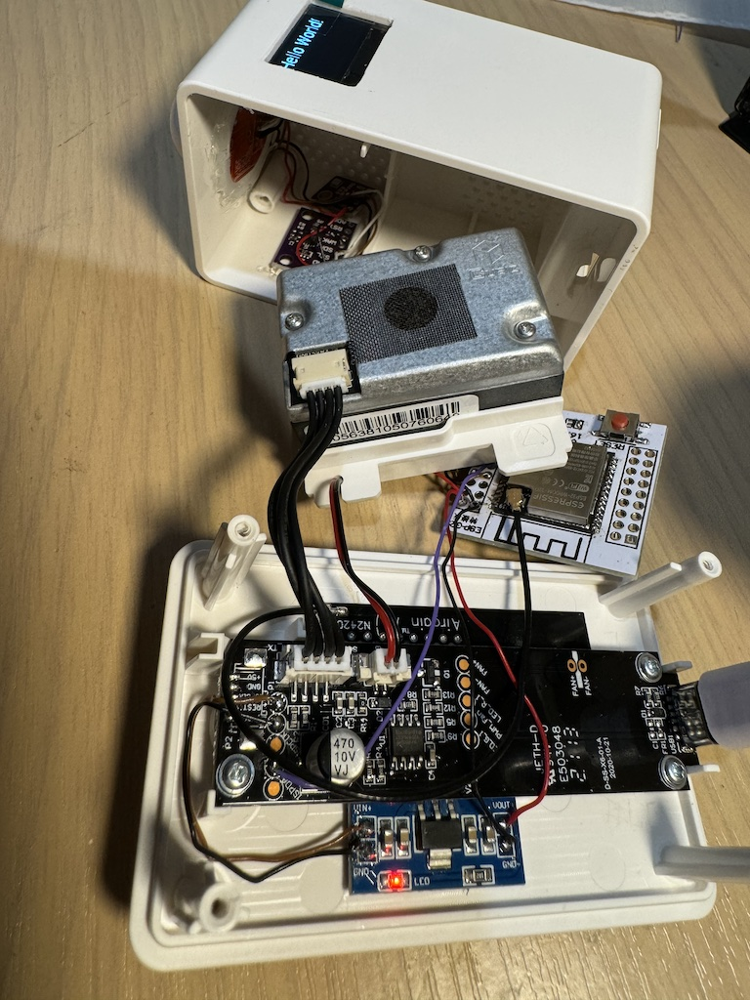

# Retrofitted IKEA VINDRIKTNING Air Quanlity Sensor

Originally, IKEA Air Quanlity Sensor only provides LED indicator on the front panel. This project is to integrate it to Home Assistant and enhance it with a screen and additional sensors to measure 
   - PM2.5 (builtin)
   - eCO2
   - TVOC
   - Temperature
   - Pressure
   - Humidity
   - Ambiant light
   - Date and time (auto sync via NTP)

All the additional modules selected here supports I2C, which simplified the wiring a lot. The PM2.5 sensor can be read via UART. 

ESPHome makes it a lot easier to integrate the device to Home Assistant.

<p align="center">
    <a href="images/outcome.jpg">
        
    </a><a href="images/home_assistant_device_page.PNG">
        
    </a>
</p>

## Component list

- [IKEA VINDRIKTNING Air quality sensor](https://www.ikea.com/au/en/p/vindriktning-air-quality-sensor-50498243/)
- ESP32, I use a core module, ESP32-WROOM-32U(4MB) + an adaptor PCB, but you can any one that fit in the case.
- [CCS811 eCO_2 and Volatile Organic Compound Sensor](https://esphome.io/components/sensor/ccs811.html)
- [BME280 Temperature+Pressure+Humidity Sensor](https://esphome.io/components/sensor/bme280.html)
- [https://esphome.io/components/sensor/bh1750.html](https://esphome.io/components/sensor/bh1750.html)
- AMS1117 5V to 3.3V Step-Down Regulator Module
- [SSD1306 OLED Display](https://esphome.io/components/display/ssd1306.html)
- Some wires

## Steps

1. Open the case of VINDRIKTNING and take out the PM2.5 module
2. Make a couple of cutouts for the ambient light sensor and the screen.

<p align="center">
    <a href="images/cutouts.jpg">
        
    </a>
</p>

3. Wiring them up. VINDRIKTNING only provides 5V power, but all the sensors and screen needs 3.3v. For the data pins. Here is the pip map from ESP to other modules.
    - GPIO21 -> SDA
    - GPIO22 -> SCL
    - GPIO19 (UART RX) -> REST pin of VINDRIKTNING main board

<p align="center">
    <a href="images/wiring_process.jpg">
        
    </a>
</p>

4. Put all the modules in place into the case. All sensors are in the uppper part of VINDRIKTNING. I put ESP32 MCU in the bottom to minimize generated heat impact sensor readings.

## ESPHome Config
Here is the ESPHome config I use. You might need to calibrate, update the filters yourself. And set your time zone in the `time/timezone` section.

```yaml
i2c:
  sda: 21
  scl: 22
  frequency: 800kHz

uart:
  rx_pin: GPIO19
  baud_rate: 9600

sensor:
  - platform: pm1006
    pm_2_5:
      id: pm25
      name: "Particulate Matter 2.5µm Concentration"
      filters:
        - delta: 1.0
  - platform: ccs811
    eco2:
      id: "eco2"
      name: "eCO2"
      filters:
        - filter_out: 400
    tvoc:
      id: "tvoc"
      name: "Total Volatile Organic Compound"
      filters:
        - lambda: !lambda |-
            if (x > 3000.0) return {};
            if (x <= 1.0) return {};
            return x;
    address: 0x5A
    update_interval: 30s
  - platform: bme280
    temperature:
      id: temperature
      name: "Temperature"
      oversampling: 16x
      filters:
        - offset: -1.5
    pressure:
      id: "presure"
      name: "Pressure"
    humidity:
      id: "humidity"
      name: "Humidity"
    address: 0x76
    update_interval: 60s
  - platform: bh1750
    id: illuminance
    name: "Illuminance"
    address: 0x23
    update_interval: 10s
    filters:
      - calibrate_linear:
          - 0.1 -> 0
          - 14.8 -> 13
      - lambda: !lambda |-
          if (x < 0) return 0.0;
          return x;

font:
  - file: "gfonts://Roboto"
    id: roboto
    size: 12

time:
  - platform: sntp
    id: sntp_time
    timezone: "AEST-10AEDT-11,M10.1.0/02:00:00,M4.1.0/03:00:00"


display:
  - platform: ssd1306_i2c
    model: "SSD1306 128x64"
    address: 0x3C
    lambda: |-
      it.printf(0, 0, id(roboto), "PM2.5  %.0f", id(pm25).state);
      it.printf(0, 12, id(roboto),  "T%.1f °C   H%.1f% %%", id(temperature).state, id(humidity).state);
      it.printf(0, 24, id(roboto), "%.1f lx  %.1f hPa", id(illuminance).state, id(presure).state);
      it.printf(0, 36, id(roboto), "eCO2 %.0f  TVOC %.0f", id(eco2).state, id(tvoc).state);
      it.strftime(15, 48, id(roboto), "%Y-%m-%d %H:%M", id(sntp_time).now());

```
